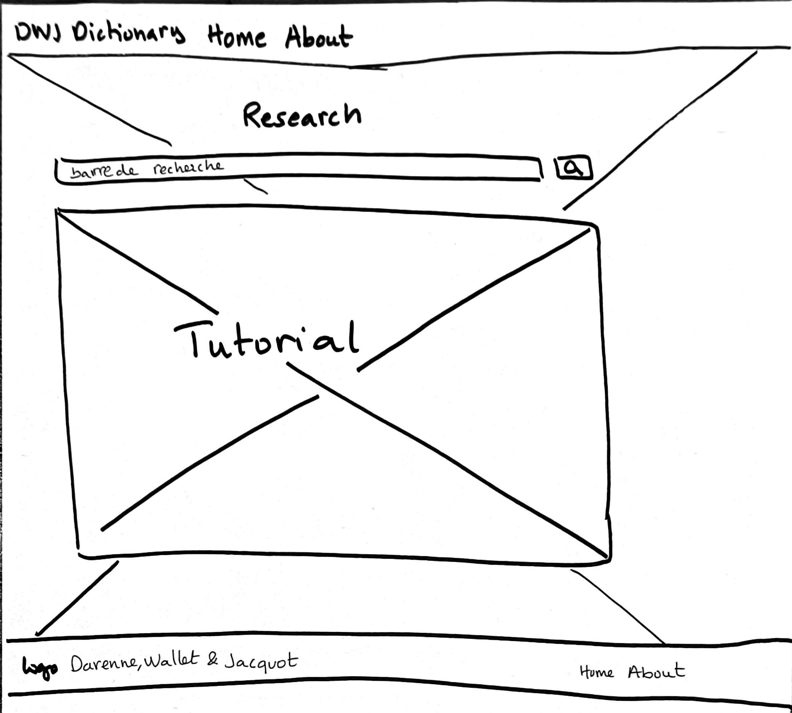
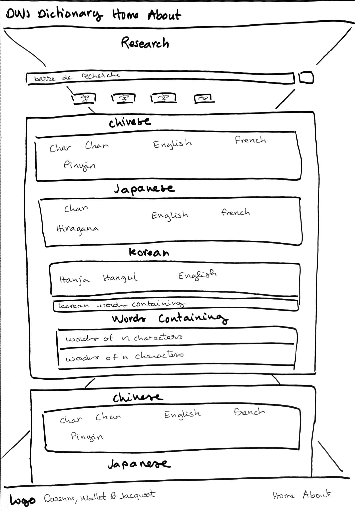
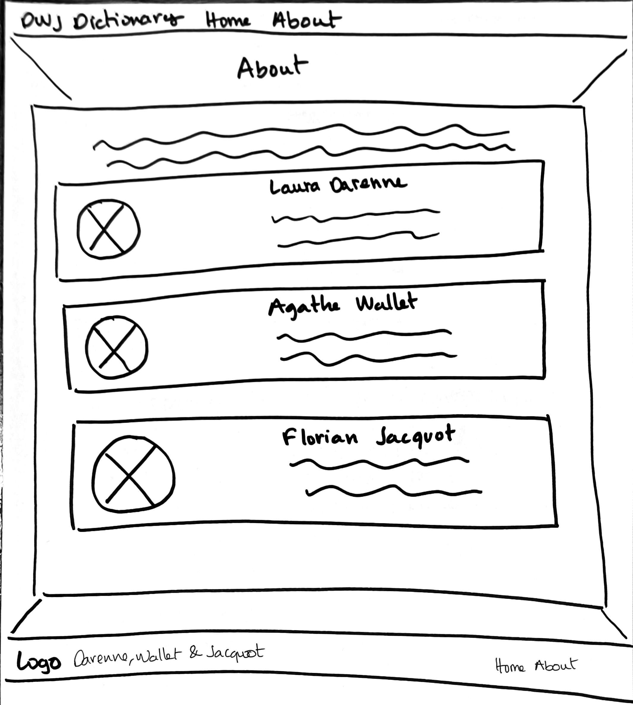

# M2S2_superapplication

## Présentation du projet
Ce projet d'application a été développé dans le cadre du cours "Techniques Web" du Master en Traitement Automatique des Langues (TAL) à l'Inalco. L'objectif principal était de créer une application mettant en pratique les compétences acquises durant le cours, notamment la programmation avec FastAPI, HTML, CSS, JavaScript et jQuery. Nous avons donc décidé de concevoir un dictionnaire multilingue regroupant le chinois, le japonais et le coréen.

Ces trois langues, malgré leurs systèmes d'écriture et leurs grammaires distincts, partagent un certain nombre de caractères communs, appelés hanja en coréen et kanji en japonais. De plus, elles disposent d'un vocabulaire commun, souvent emprunté au chinois, avec des lectures similaires voire identiques.

L'idée maîtresse de cette application est de venir en aide aux apprenants de ces langues qui peuvent éprouver des difficultés à mémoriser les caractères et à saisir les nuances de sens qu'ils peuvent véhiculer dans chacune de ces langues. De plus, les ressources actuelles ont tendance à traiter ces langues de manière isolée, sans mettre en lumière leurs liens et leurs similitudes. C'est pourquoi nous avons opté pour cette approche plurilingue.

## Cahier des charges

### Les objectifs et le public cible

L'objectif principal était donc de développer une application permettant à l'utilisateur d'effectuer une recherche d'un caractère, d'un mot ou d'une phrase en japonais, en chinois ou en coréen, afin d'obtenir des informations sur le ou les mots dans toutes les langues simultanément. Nous avons finalement privilégié la recherche en chinois (simplifié ou traditionnel), tout en conservant les résultats de recherche dans les autres langues. Les différentes significations des caractères sont affichées en anglais, et parfois en français, puisque nous ciblons un public d'apprenants de ces trois langues.

Voici quelques fonctionnalités que nous n'avons malheureusement pas pu intégrer :

- Recherche en japonais ou en coréen : nous avons rencontré des difficultés dans la prise en charge des termes qui ne s'écrivent pas en caractères chinois.
- Recherche en français ou en anglais : cela aurait nécessité la traduction automatique complète de la phrase, ce qui aurait pu entraîner de nombreuses erreurs.

### État de l'art
- [Naver](https://dict.naver.com/frkodict/#/search?query=%E9%9F%93) : ne propose pas de page multilingue, il est possible de chercher dans plusieurs langues, mais une page distincte est créée pour chaque langue, ce qui n'est pas pratique pour comparer les significations des caractères dans différentes langues. De même, la recherche de caractères hanja se fait uniquement en coréen.
- [Daum 사전](https://dic.daum.net/search.do?q=%E9%9F%93) : principalement destiné aux locuteurs coréens.
- [Dictionnaire de Hanja](https://koreanhanja.app/%e9%9f%93) : Permet de récupérer le sens des hanja ou de mots sino-coréen en anglais.
- [Pleco](https://www.pleco.com) (téléphone): propose uniquement le chinois, mais est très bien conçu, dictionnaire gratuit mais avec la possibilité d'acheter et rajouter des dictionnaires sur l'application
- [JCdic](http://www.jcdic.com/chinese_convert/index.php) : convertisseur chinois (classique, simplifié) - japonais
- [Glosbe](https://glosbe.com/) : API avec des dictionnaires gratuits, actuellement non disponible à cause de trop grandes attaques DDOS
- [Make Me A Hanzi](https://github.com/skishore/makemeahanzi) : permet d'afficher un caractère chinois en donnant l'ordre des traits
- [Hanyudic](https://github.com/guilhemmariotte/HanYuDic) et [FrCndict](https://github.com/Nilhcem/frcndict-android) : dictionnaires chinois-français utilisant des base de données open-source
- [Dictionnaire chinois](http://dict.cn/) : dictionnaire chinois en ligne
- [KanjiAlive](https://kanjialive.com/) et [Kanji-Search](https://github.com/TashiiDesign/Kanji-Search) : apprendre à écrire un caractère en respectant l'ordre des traits japonais

### Ergonomie

Nous avons opté pour un design simple et épuré pour notre application.

Nous avons choisi de nommer notre application "DWJ Dictionary", en utilisant les initiales de nos trois noms de famille. Le nom de l'application constitue également le logo de celle-ci.

Notre menu comprend le logo de notre dictionnaire, qui est cliquable et redirige vers la page d'accueil, également accessible via l'onglet `Home`. La page d'accueil est la page principale où l'utilisateur effectue sa recherche et où les résultats s'affichent. Une seconde page est accessible via cette barre de navigation : `About`, qui présente brièvement l'application et les personnes qui l'ont conçue.

Le site présente un fond coloré, mais qui ne distrait pas l'œil de l'utilisateur. Il s'agit d'une estampe japonaise tirée du Recueil des traditions de jadis et de naguère, exposé au Musée Cernuschi. Le contenu de la page est encadré dans un fond blanc aux contours arrondis, ce qui permet de le faire ressortir sur l'image de fond tout en conservant une certaine douceur.

La police utilisée est une police fournie par Bootstrap et prise en charge par tous les navigateurs. L'application s'adapte également à toutes les tailles d'écran (ordinateur, tablette, téléphone, etc.). Il est possible de zoomer ou dézoomer le contenu sans que cela n'affecte la mise en page ni l'expérience utilisateur (pas de défilement horizontal notamment). Le contenu complémentaire est masqué par défaut pour éviter une surcharge d'informations sur la page, mais reste accessible en un clic via des accordéons.

### Liste des fonctionnalités

#### Côté interface

* **Une barre de recherche** située en haut de la page d'accueil, permettant à l'utilisateur de saisir facilement un caractère, un mot ou une phrase en chinois simplifié ou traditionnel. La recherche se lance automatiquement lorsque l'utilisateur appuie sur la touche "Entrée" ou clique sur l'icône de loupe.
* **Une page `Home`** affichant les résultats de la recherche, triés par langue (chinois, japonais, coréen) et par type de résultat (caractère, mot). Pour chaque résultat, sont indiqués son écriture dans sa langue, sa prononciation (en pinyin, hiragana ou hangŭl), ainsi que sa traduction en français et en anglais.
* **Une page `About`** présentant l'application et les personnes qui l'ont conçue. Cette page est accessible depuis le menu principal de l'application.
* **Un tutoriel** expliquant de manière détaillée comment utiliser l'application et présentant les différentes fonctionnalités. Il présente également des exemples cliquables permettant de tester les fonctionnalités du site, même pour les personnes ne connaissant pas le chinois. Le tutoriel est accessible depuis la page d'accueil. 
* **Un indicateur de chargement** (loader) s'affichant à l'écran lorsque l'utilisateur effectue une recherche, et disparaissant dès que les résultats sont affichés. Cet indicateur permet à l'utilisateur de savoir que l'application est en train de traiter sa requête et qu'il doit patienter quelques instants.
* **Des accordéons** permettant d'afficher ou de masquer des informations complémentaires sur les résultats de la recherche (par exemple, les mots contenant le caractère recherché). L'utilisateur peut cliquer sur le titre de l'accordéon pour afficher ou masquer son contenu.

#### Côté serveur

* Utilisation de la librairie Python **FastAPI** :
	+ Utilisation de **FastAPI** pour créer l'API de l'application et gérer les requêtes HTTP entrantes et sortantes ;
	+ Utilisation de **Jinja2Templates** pour le rendu des templates HTML. Jinja2 est une bibliothèque Python permettant de générer des templates HTML dynamiques. Elle a été utilisée pour générer les pages HTML de l'application en fonction des données récupérées depuis la base de données ;
	+ Utilisation de **StaticFiles** pour utiliser des fichiers dits statiques tels que des images, des feuilles de styles CSS et des fichiers JavaScript ;
	+ Utilisation de **HTMLResponse** qui permet de renvoyer une réponse HTTP avec un corps HTML.
* Utilisation de la bibliothèque **requests** pour les requêtes HTTP vers l'API externe de [koreanhanja.app](https://koreanhanja.app/).
* Utilisation de la bibliothèque **Pandas** pour la manipulation des données. Elle a été utilisée pour manipuler les données récupérées depuis les bases de données du chinois et du japonais pour les mettre en forme avant de les envoyer vers l'interface utilisateur.
* Utilisation de la bibliothèque **re** (expressions régulières) pour la vérification de la validité des caractères chinois saisis par l'utilisateur. Les expressions régulières sont également utilisées pour extraire les informations pertinentes des résultats de la recherche de [koreanhanja.app](https://koreanhanja.app/).
* Utilisation de la bibliothèque **HanziConv** pour la conversion entre les caractères chinois simplifiés et traditionnels.
* Utilisation de la bibliothèque **Jieba** pour la segmentation des phrases/mots en chinois entrés par l'utilisateur.
* Utilisation de **bases de données** au format tsv conçues à partir des dictionnaires suivants :
	+ [CFDICT](https://chine.in/mandarin/dictionnaire/CFDICT/), Base de données "chinois - français"
	+ [CC-DICT](https://www.mdbg.net/chinese/dictionary?page=cedict), Base de données "chinois - anglais"
	+ [JMdict-EDICT](http://www.edrdg.org/wiki/index.php/JMdict-EDICT_Dictionary_Project), Base de données "japonais - anglais/français/allemand/russe/espagnol/hongrois/slovène/néerlandais"

### Conception : tâches et répartition

- Laura Darenne : dictionnaire chinois, design du site, de la partie chinoise et japonaise
- Florian Jacquot : dictionnaire japonais, mise en place du loader, rédaction du tutoriel
- Agathe Wallet : dictionnaire coréen, design du site et de la partie coréenne, création des avatars

## Les visuels

